# Hi, I'm Pearl Rana

**Computer Science & Business Systems Student** · Software Developer · Web Developer

 

<picture>
  <source media="(prefers-color-scheme: dark)" srcset="assets/hero-dark.svg">
  <source media="(prefers-color-scheme: light)" srcset="assets/hero-light.svg">
  
</picture>

  

## About

I'm a CS & Business Systems student at Thapar Institute of Engineering and Technology, building software and web applications end to end — frontend interfaces, backend services, and the databases underneath. I work primarily with React, Python, and SQL, and I'm steadily sharpening my backend and data-structures fundamentals through practical projects rather than tutorials.

 

## Tech Stack

<table>
<tr>
<td valign="top" width="20%">

**Languages**

</td>
<td valign="top" width="20%">

**Frontend**

</td>
<td valign="top" width="20%">

**Backend**

</td>
<td valign="top" width="20%">

**Databases**

</td>
<td valign="top" width="20%">

**Tools**

</td>
</tr>
</table>

 

## Currently Building & Learning

 

## GitHub Activity

<picture>
  <source media="(prefers-color-scheme: dark)" srcset="https://raw.githubusercontent.com/pearlrana/pearlrana/output/snake-dark.svg">
  <source media="(prefers-color-scheme: light)" srcset="https://raw.githubusercontent.com/pearlrana/pearlrana/output/snake-light.svg">
  
</picture>

  

## Connect

